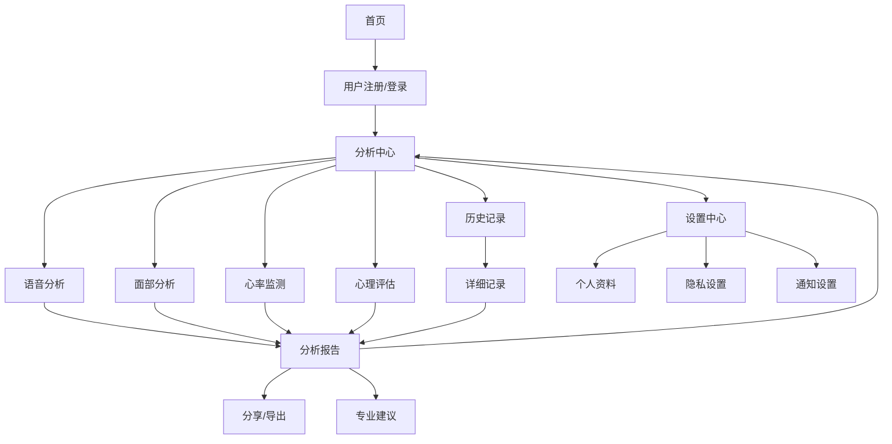

# EmotionFusion 多模态情感分析系统
## 产品需求文档 (PRD)

### 1. 产品概述

EmotionFusion是一款基于Web的智能化多模态情感分析平台，通过整合语音、面部、文字、心率等多种数据源，为用户提供专业、准确的情感状态分析和心理健康评估服务。系统采用先进的AI技术，结合心理学理论，为个人用户、心理咨询机构和健康管理组织提供科学的心理健康监测工具。

**核心价值主张：**
- 多维度情感识别：整合语音、视觉、生理信号进行综合分析
- 实时监测预警：提供即时情感状态反馈和异常预警
- 专业心理评估：基于标准化量表的专业心理健康评估
- 隐私保护优先：本地化数据处理，保障用户隐私安全

**目标用户群体：**
- 关注心理健康的个人用户
- 心理咨询和治疗机构
- 企业人力资源和员工关怀部门
- 教育机构和学生心理健康中心

### 2. 核心功能模块

#### 2.1 多模态情感分析系统

**语音情感分析模块**
- 实时录音功能：支持高质量音频录制和回放
- 文件上传分析：支持MP3、WAV、WebM格式音频文件
- 语音转文字：集成浏览器原生语音识别API（支持中文）
- 情感极性分析：通过DeepSeek API进行深度语义情感分析
- 情绪分类：识别快乐、悲伤、愤怒、恐惧、惊讶、中性等6种基本情绪
- 情感强度评估：0-100分量化情感强度
- 关键词提取：自动提取情感相关关键词汇

**面部情感分析模块**
- 实时摄像头拍照：支持前置摄像头实时拍照
- 图片上传分析：支持JPG、PNG格式图片文件
- 人脸检测：基于OpenCV的Haar级联分类器
- 表情识别：识别7种基本面部表情（快乐、悲伤、愤怒、惊讶、恐惧、厌恶、中性）
- 疲劳检测：集成眨眼检测算法，评估疲劳程度
- 年龄性别估计：基于面部特征的年龄段和性别预测
- 多人脸支持：同时分析多张人脸的情感状态

**OCR文字情感分析模块**
- 图片文字提取：基于RapidOCR引擎的高精度文字识别
- 多语言支持：支持中文、英文、数字混合识别
- 手写文字识别：支持手写文字的情感分析
- 文字情感分析：通过AI模型分析文本情感倾向
- 情感关键词高亮：突出显示情感相关词汇
- 文本摘要生成：自动生成情感分析摘要

**rPPG心率检测模块**
- 非接触式心率测量：基于远程光电容积描记技术
- 实时心率监测：30FPS实时心率数据更新
- 心率变异性分析：评估自主神经系统活性
- 血氧饱和度估计：基于面部血氧变化的SpO2估算
- 压力指数计算：结合心率变异性评估压力水平
- 数据可视化：实时心率曲线和历史趋势图

#### 2.2 眨眼和疲劳检测系统

**眨眼检测功能**
- 实时眨眼监测：基于MediaPipe FaceMesh的468个面部关键点
- EAR算法实现：Eye Aspect Ratio计算，精确识别眨眼动作
- 眨眼频率统计：单位时间内眨眼次数统计
- 异常眨眼预警：检测异常眨眼模式（过快/过慢）

**疲劳程度评估**
- PERCLOS计算：单位时间内眼睛闭合比例
- 连续闭眼时间：检测危险的长闭眼行为
- 疲劳指数评分：0-100分量化疲劳程度
- 多级预警机制：轻度/中度/重度疲劳分级预警
- 实时提醒功能：疲劳超标时的声音和视觉提醒

**WebSocket实时通信**
- 低延迟数据传输：<100ms端到端延迟
- 断线自动重连：网络异常时的自动重连机制
- 二进制数据传输：Base64编码图像数据的高效传输
- 并发连接支持：支持多用户同时在线监测

#### 2.3 心理评估量表系统

**专业评估题库**
- 100道标准化心理测评题目
- 5大核心维度评估：情绪状态、社交能力、压力水平、自我认知、生活满意度
- 科学评分体系：基于心理学理论的量化评分
- 难度梯度设计：从基础到深入的渐进式评估

**评估维度详解**

| 评估维度 | 题目数量 | 评估内容 | 评分标准 |
|---------|---------|---------|---------|
| 情绪状态 | 20题 | 抑郁、焦虑、情绪波动、情感麻木 | 0-3分四级量表 |
| 社交能力 | 20题 | 人际交往、沟通能力、社交焦虑、人际信任 | 0-3分四级量表 |
| 压力水平 | 20题 | 工作压力、生活压力、应对策略、身心症状 | 0-3分四级量表 |
| 自我认知 | 20题 | 自尊水平、自我效能、人生目标、自我接纳 | 0-3分四级量表 |
| 生活满意度 | 20题 | 生活质量、幸福感、成就感、未来期望 | 0-3分四级量表 |

**智能评估流程**
- 自适应题目调整：根据用户回答动态调整后续题目
- 答题时间控制：每题30秒标准答题时间
- 进度实时显示：答题进度条和剩余时间提醒
- 暂停续答功能：支持评估过程暂停和继续

**结果分析与报告**
- 多维度雷达图：五维度能力可视化展示
- 详细分析报告：每维度的详细得分和解释
- 风险等级评估：健康/轻微/中等/严重四级分类
- 个性化建议：基于评估结果的定制化建议
- 历史趋势分析：多次评估结果的对比分析
- 专业建议推荐：严重情况下的专业求助指导

#### 2.4 AI智能对话分析

**DeepSeek API集成**
- 大语言模型：基于DeepSeek的对话理解能力
- 多轮对话支持：上下文相关的连续对话
- 情感理解：深度理解用户情感表达
- 专业建议：提供心理健康相关的专业建议

**对话场景支持**
- 情感倾诉：用户情感表达的倾听和理解
- 心理支持：提供心理健康相关的支持和建议
- 危机干预：识别危机信号并提供适当引导
- 日常陪伴：日常情感交流和心理陪伴

### 3. 用户角色和权限设计

#### 3.1 用户角色定义

| 用户角色 | 注册方式 | 核心权限 | 功能差异 |
|---------|---------|---------|---------|
| 普通用户 | 邮箱/手机号注册 | 基础情感分析、心理评估 | 标准功能访问 |
| 高级用户 | 邀请码升级 | 高级分析功能、历史记录 | 深度分析报告 |
| 专业用户 | 资质认证 | 专业工具、客户管理 | 批量分析、报告导出 |
| 管理员 | 系统内置 | 系统管理、数据分析 | 全权限访问 |

#### 3.2 权限控制体系

**功能权限矩阵**
- 情感分析模块：基础版/专业版分级访问
- 心理评估系统：完整评估/快速评估选项
- 历史数据查看：本地存储/云端同步
- 报告导出功能：PDF导出/在线查看
- API访问权限：调用频率和数据范围限制

### 4. 核心页面流程设计

#### 4.1 主要页面结构

**1. 首页（Landing Page）**
- 产品价值主张展示
- 核心功能亮点介绍
- 用户评价和案例展示
- 快速开始引导流程
- 产品特色对比说明

**2. 分析中心（Analysis Dashboard）**
- 多模态分析入口导航
- 最近分析结果快速查看
- 分析历史时间轴展示
- 个人情感趋势概览
- 快速操作快捷入口

**3. 语音分析页面（Voice Analysis）**
- 录音控制面板
- 音频波形可视化
- 实时语音转写显示
- 情感分析结果展示
- 历史语音记录管理

**4. 面部分析页面（Face Analysis）**
- 摄像头预览区域
- 拍照控制按钮
- 实时人脸检测框
- 表情识别结果图表
- 疲劳指数实时显示

**5. 心率监测页面（Heart Rate Monitor）**
- 实时心率数字显示
- 心率变化曲线图
- 监测状态指示器
- 心率变异性指标
- 压力指数实时计算

**6. 心理评估页面（Psychological Assessment）**
- 评估介绍和说明
- 题目展示区域
- 答题选项按钮
- 进度条显示
- 答题倒计时

**7. 分析报告页面（Analysis Report）**
- 综合分析结果总览
- 多维度雷达图展示
- 详细数据表格
- 趋势变化图表
- 个性化建议内容

#### 4.2 页面导航流程图

### 5. 用户界面设计规范

#### 5.1 设计系统（Design System）

**色彩体系**
- 主色调：#3B82F6（蓝色）- 代表专业性和可信度
- 辅助色：#8B5CF6（紫色）- 体现科技感和创新性
- 强调色：#EC4899（粉色）- 用于重要操作和提醒
- 深色：#1E293B（深蓝灰）- 文字和背景对比
- 浅色：#F8FAFC（浅灰）- 背景和卡片颜色

**字体系统**
- 主字体：Inter - 现代无衬线字体，优秀的可读性
- 中文字体：系统默认字体栈，确保跨平台一致性
- 字号层级：xs(12px)、sm(14px)、base(16px)、lg(18px)、xl(20px)、2xl(24px)
- 字重设置：normal(400)、medium(500)、semibold(600)、bold(700)

**间距规范**
- 基础单位：4px网格系统
- 间距层级：0、1(4px)、2(8px)、3(12px)、4(16px)、5(20px)、6(24px)、8(32px)、10(40px)
- 圆角设置：none、sm(2px)、default(4px)、md(6px)、lg(8px)、xl(12px)、2xl(16px)、3xl(24px)

**阴影效果**
- 小阴影：0 1px 3px 0 rgba(0, 0, 0, 0.1)
- 中阴影：0 4px 6px -1px rgba(0, 0, 0, 0.1)
- 大阴影：0 10px 15px -3px rgba(0, 0, 0, 0.1)

#### 5.2 组件设计规范

**按钮组件（Button）**
- 主要按钮：渐变背景、白色文字、圆角设计
- 次要按钮：边框设计、主色调文字、hover背景变化
- 危险按钮：红色主题、用于删除和危险操作
- 尺寸规范：小(32px)、中(40px)、大(48px)
- 状态设计：默认、hover、active、disabled、loading

**卡片组件（Card）**
- 统一圆角：8px圆角设计
- 阴影效果：hover时增强阴影效果
- 内边距：标准16px内边距
- 悬停效果：轻微上移和阴影增强
- 响应式：移动端自适应调整

**表单组件（Form）**
- 输入框：统一边框样式、focus状态高亮
- 标签文字：清晰的对齐和间距
- 错误提示：红色边框和图标提示
- 成功验证：绿色边框和图标反馈
- 帮助文字：灰色辅助说明文字

**图表组件（Chart）**
- 颜色规范：使用设计系统色彩
- 动画效果：平滑的过渡动画
- 响应式设计：自适应容器大小
- 交互反馈：hover高亮和详细提示
- 数据标签：清晰的数据展示

#### 5.3 响应式设计规范

**断点设置**
- 移动端：< 640px（单列布局）
- 平板端：640px - 1024px（双列布局）
- 桌面端：> 1024px（多列布局）

**适配策略**
- 移动优先：基础设计针对移动端
- 弹性布局：使用Flexbox和Grid
- 图片响应：自适应图片大小
- 字体缩放：根据屏幕尺寸调整
- 触摸优化：增大触摸目标区域

### 6. 技术实现要求

#### 6.1 前端技术要求

**核心技术栈**
- HTML5 + CSS3 + JavaScript (ES6+)
- TailwindCSS：现代化CSS框架
- 原生Web API：WebRTC、WebSocket、Web Workers
- Canvas API：图像处理和绘制
- Web Audio API：音频处理和分析

**浏览器兼容性**
- Chrome 80+（推荐）
- Firefox 75+
- Safari 13+
- Edge 80+
- 移动端浏览器：iOS Safari 13+、Chrome Android 80+

**性能要求**
- 首屏加载时间：< 3秒
- 交互响应时间：< 100ms
- 动画帧率：60 FPS
- 内存占用：< 500MB
- CPU使用率：< 70%

#### 6.2 后端技术要求

**服务架构**
- FastAPI：眨眼检测服务（端口8001）
- Flask：OCR文字识别服务（端口5002）
- WebSocket：实时通信支持
- RESTful API：标准HTTP接口

**AI模型集成**
- MediaPipe：人脸关键点检测
- OpenCV：计算机视觉处理
- RapidOCR：文字识别引擎
- DeepSeek API：大语言模型

**性能指标**
- API响应时间：< 500ms
- 并发处理能力：100+ 并发请求
- WebSocket连接数：1000+ 同时连接
- 图像处理速度：< 200ms/张
- 内存使用优化：< 1GB峰值内存

### 7. 数据安全和隐私保护

#### 7.1 数据收集原则

**最小化收集**
- 只收集必要的用户数据
- 明确告知数据用途
- 提供数据删除选项
- 定期清理过期数据

**本地化处理**
- 优先在本地处理敏感数据
- 减少云端数据传输
- 加密存储敏感信息
- 提供离线使用模式

#### 7.2 隐私保护措施

**数据加密**
- 传输加密：HTTPS/TLS 1.3
- 存储加密：AES-256加密
- 密钥管理：安全的密钥存储
- 端到端加密：敏感通信加密

**访问控制**
- 用户身份验证
- 权限分级管理
- 会话安全管理
- 审计日志记录

**合规要求**
- GDPR合规：欧盟数据保护法规
- CCPA合规：加州消费者隐私法案
- 中国网络安全法合规
- 数据跨境传输规范

### 8. 质量保证和测试

#### 8.1 测试策略

**单元测试**
- JavaScript函数单元测试
- Python API接口测试
- AI算法准确性测试
- 数据处理逻辑测试

**集成测试**
- 前后端接口集成测试
- 第三方服务集成测试
- WebSocket通信测试
- 多浏览器兼容性测试

**性能测试**
- 负载压力测试
- 并发用户测试
- 长时间运行测试
- 内存泄漏检测

**用户体验测试**
- 可用性测试
- 可访问性测试
- 响应式设计测试
- 交互流畅度测试

#### 8.2 质量指标

**功能性指标**
- 功能完整性：100%需求覆盖
- 准确性：情感识别准确率>85%
- 稳定性：系统可用性>99.9%
- 兼容性：主流浏览器全支持

**性能指标**
- 响应速度：页面加载<3秒
- 并发能力：支持1000+同时用户
- 资源消耗：内存CPU合理使用
- 扩展性：支持水平扩展

**用户体验指标**
- 易用性：学习成本低，操作简单
- 可访问性：符合WCAG 2.1标准
- 满意度：用户满意度>4.5/5.0
- 留存率：月活跃用户留存>60%

### 9. 部署和运维

#### 9.1 部署架构

**环境配置**
- 开发环境：本地开发服务器
- 测试环境：模拟生产环境
- 预生产环境：生产环境副本
- 生产环境：高可用集群部署

**容器化部署**
- Docker容器化封装
- Kubernetes集群管理
- 自动扩缩容配置
- 服务网格集成

#### 9.2 监控告警

**应用监控**
- 性能指标监控
- 错误日志收集
- 用户行为分析
- 业务指标统计

**基础设施监控**
- 服务器资源监控
- 网络状态监控
- 数据库性能监控
- 第三方服务监控

**告警机制**
- 多渠道告警：邮件、短信、即时通讯
- 告警分级：警告、严重、致命
- 自动恢复：故障自愈机制
- 告警收敛：避免告警风暴

### 10. 项目里程碑和交付物

#### 10.1 开发阶段规划

**第一阶段：核心功能开发（4周）**
- 基础架构搭建
- 多模态分析功能实现
- 心理评估系统开发
- 基础UI界面完成

**第二阶段：功能完善（3周）**
- 高级分析功能
- 数据可视化优化
- 用户体验改进
- 性能优化调试

**第三阶段：测试优化（2周）**
- 全面测试执行
- 问题修复优化
- 安全漏洞修复
- 文档完善更新

**第四阶段：上线准备（1周）**
- 生产环境部署
- 监控告警配置
- 用户培训材料
- 上线发布准备

#### 10.2 交付物清单

**技术交付物**
- 完整源代码和文档
- 部署配置脚本
- 数据库设计文档
- API接口文档
- 测试用例和报告

**产品交付物**
- 产品使用手册
- 用户操作指南
- 管理员操作手册
- 常见问题解答
- 培训演示材料

**运维交付物**
- 系统部署指南
- 监控配置说明
- 故障处理手册
- 备份恢复方案
- 安全操作规范

---

**文档版本：** 1.0.0  
**产品版本：** v1.0.0  
**最后更新：** 2025年1月20日  
**产品经理：** EmotionFusion产品团队  
**技术负责人：** 开发团队负责人