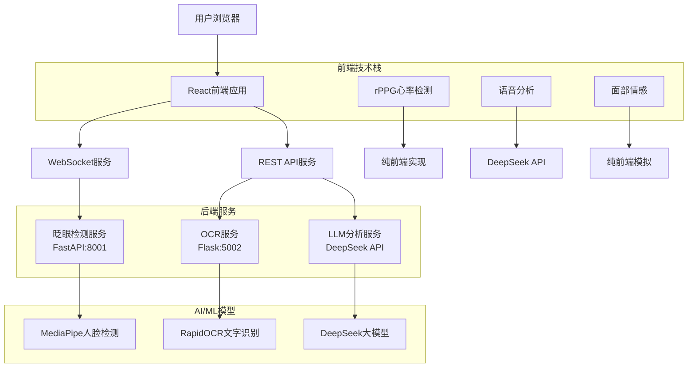
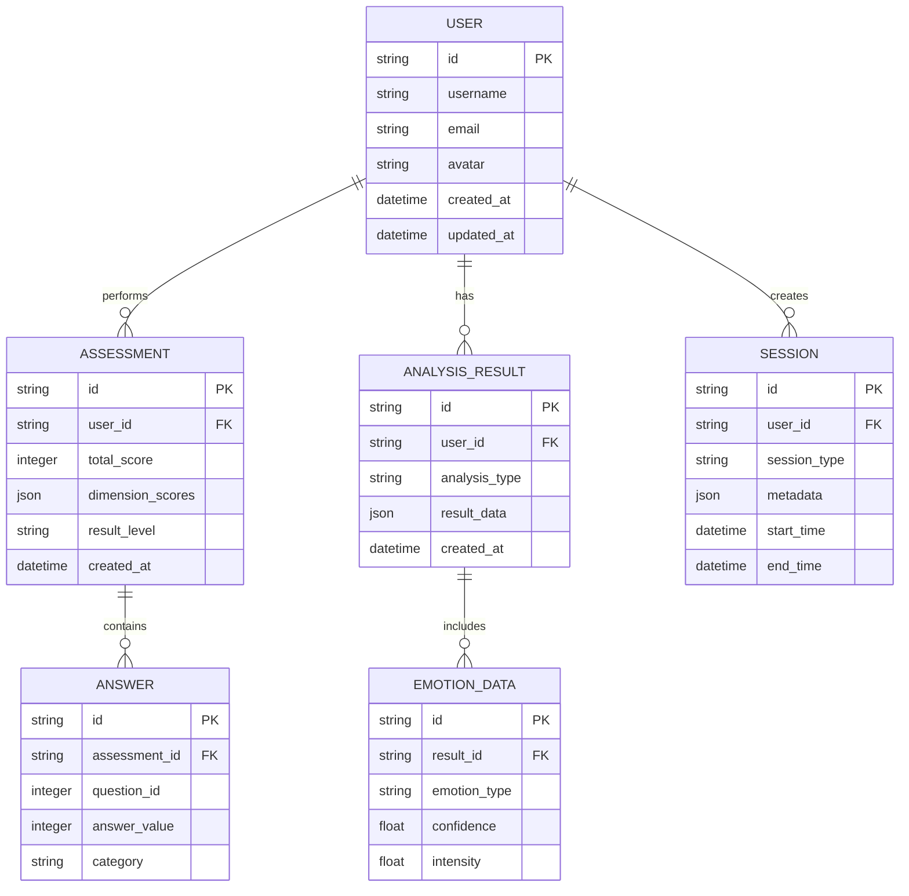

# EmotionFusion 多模态情感分析系统
## 技术架构文档

### 1. 项目概述

EmotionFusion是一个基于Web的多模态情感分析系统，集成了语音、面部、OCR文字识别、rPPG心率检测等多种AI技术，提供实时情感分析和心理评估服务。系统采用现代化的前端UI设计，支持实时WebSocket通信，为用户提供专业的心理健康监测和分析功能。

**核心功能模块：**
- 多模态情感分析（语音、面部、OCR、rPPG）
- 眨眼和疲劳检测
- 心理评估量表（100题专业评估）
- 实时心率监测
- AI智能对话分析

### 2. 系统架构设计

#### 2.1 整体架构图



#### 2.2 技术栈说明

**前端技术栈：**
- HTML5 + JavaScript (ES6+)
- TailwindCSS 3.4.13 - 现代化CSS框架
- Font Awesome - 图标库
- GSAP - 动画库
- AOS - 滚动动画
- Chart.js - 数据可视化
- WebRTC - 媒体设备访问
- WebSocket - 实时通信

**后端技术栈：**
- FastAPI - 眨眼检测服务
- Flask - OCR文字识别服务
- Python 3.10 - 主要开发语言
- MediaPipe - 人脸关键点检测
- OpenCV - 计算机视觉
- RapidOCR - 文字识别引擎

**AI服务集成：**
- DeepSeek API - 大语言模型分析
- 浏览器原生API - 语音识别

### 3. 核心功能模块详细设计

#### 3.1 多模态情感分析模块

##### 3.1.1 语音情感分析
```javascript
// 核心技术实现
- 音频录制：使用MediaRecorder API
- 实时转写：浏览器原生SpeechRecognition
- 情感分析：DeepSeek API进行文本情感分析
- 支持格式：WAV、MP3、WebM
```

**技术特点：**
- 支持实时录音和文件上传双模式
- 集成浏览器原生语音识别（中文）
- 通过DeepSeek API进行深度语义分析
- 提供情感极性、强度、关键词提取

##### 3.1.2 面部情感分析
```javascript
// 模拟分析实现
- 图像预处理：Canvas API
- 特征提取：模拟人脸关键点检测
- 情感分类：基于规则的模拟算法
- 疲劳检测：集成眨眼检测API
```

**技术实现：**
- 支持摄像头实时拍照和图片上传
- 集成眨眼检测WebSocket服务
- 提供7种基本情感分类（快乐、悲伤、愤怒等）
- 疲劳指数计算和预警

##### 3.1.3 OCR文字情感分析
```python
# OCR服务架构
- 引擎：RapidOCR（基于ONNXRuntime）
- 语言支持：中文、英文、数字
- 输出格式：文本行数组
- 处理速度：<500ms（单张图片）
```

**服务接口：**
- Flask RESTful API
- 支持文件上传和Base64编码
- CORS跨域支持
- 健康检查端点

##### 3.1.4 rPPG心率检测
```javascript
// rPPG技术实现
- 原理：基于面部血容量变化的远程光电容积描记
- 算法：峰值检测 + 频域分析
- 精度：±3 BPM（理想条件下）
- 实时性：30FPS处理速度
```

**核心算法：**
- 面部ROI区域提取
- 绿色通道信号处理
- 带通滤波（0.7-4.0 Hz）
- 峰值检测和心率计算

#### 3.2 眨眼和疲劳检测模块

##### 3.2.1 技术架构
```python
# FastAPI服务设计
- 框架：FastAPI + Uvicorn
- 端口：8001
- 模型：MediaPipe FaceMesh（468个关键点）
- 算法：EAR（Eye Aspect Ratio）计算
```

##### 3.2.2 EAR算法实现
```python
def eye_aspect_ratio(landmarks, eye_idx):
    p = np.array([landmarks[i] for i in eye_idx])
    A = np.linalg.norm(p[1] - p[5])  # 垂直距离1
    B = np.linalg.norm(p[2] - p[4])  # 垂直距离2
    C = np.linalg.norm(p[0] - p[3])  # 水平距离
    ear = (A + B) / (2.0 * C)
    return ear
```

**疲劳指标：**
- EAR阈值：0.21（闭眼判断）
- PERCLOS：单位时间内眼睛闭合比例
- 连续闭眼帧数：疲劳预警
- 疲劳指数：0-100分量化评分

##### 3.2.3 WebSocket实时通信
```python
# WebSocket协议设计
- 连接：ws://localhost:8001/ws
- 消息格式：JSON（Base64图像数据）
- 响应频率：30FPS
- 断线重连：自动重试机制
```

#### 3.3 心理评估量表模块

##### 3.3.1 评估体系设计
```javascript
// 量表结构
- 题目数量：100道专业心理测评题
- 评估维度：5大核心领域
  - 情绪状态（20题）
  - 社交能力（20题）
  - 压力水平（20题）
  - 自我认知（20题）
  - 生活满意度（20题）
```

##### 3.3.2 评分算法
```javascript
// 评分规则
- 评分制：0-3分四级量表
- 权重分配：各维度等权重计算
- 结果等级：健康/轻微/中等/严重
- 建议生成：基于得分区间自动生成
```

##### 3.3.3 数据可视化
```javascript
// 图表展示
- 雷达图：五维度能力展示
- 柱状图：各维度得分对比
- 趋势线：历史评估记录
- 导出功能：PDF报告生成
```

### 4. 前端架构设计

#### 4.1 模块化架构
```
src/
├── js/
│   ├── core/
│   │   └── app.js          # 核心应用初始化
│   ├── features/
│   │   ├── audio.js        # 语音分析功能
│   │   ├── face.js         # 面部分析功能
│   │   ├── image.js        # 图像处理功能
│   │   ├── rppg.js         # 心率检测功能
│   │   └── text.js         # 文本分析功能
│   ├── modules/
│   │   ├── assessment.js   # 心理评估模块
│   │   ├── auth.js         # 用户认证模块
│   │   └── profile.js      # 用户档案模块
│   └── vendor/
│       ├── aos.js          # 动画库
│       ├── chart.min.js    # 图表库
│       └── gsap.min.js     # 动画库
```

#### 4.2 UI设计系统
```css
/* TailwindCSS配置 */
module.exports = {
  theme: {
    extend: {
      colors: {
        primary: '#3B82F6',      /* 主色调 */
        secondary: '#8B5CF6',    /* 辅助色 */
        accent: '#EC4899',       /* 强调色 */
        dark: '#1E293B',         /* 深色 */
        light: '#F8FAFC'         /* 浅色 */
      },
      fontFamily: {
        sans: ['Inter', 'system-ui', 'sans-serif']
      },
      animation: {
        'pulse-slow': 'pulse 3s cubic-bezier(0.4, 0, 0.6, 1) infinite'
      }
    }
  }
}
```

#### 4.3 响应式设计
```css
/* 断点设计 */
- 移动端：< 640px
- 平板端：640px - 1024px
- 桌面端：> 1024px

/* 布局策略 */
- 移动优先：基础样式针对移动端
- 弹性布局：Flexbox + Grid
- 自适应组件：卡片、表格、表单
```

### 5. 后端服务架构

#### 5.1 眨眼检测服务（FastAPI）
```python
# 服务配置
app = FastAPI()
app.add_middleware(
    CORSMiddleware,
    allow_origins=["*"],
    allow_methods=["*"],
    allow_headers=["*"]
)

# 核心端点
@app.post("/blink")           # 单张图片检测
@app.websocket("/ws")         # WebSocket实时流
@app.get("/health")           # 健康检查
```

#### 5.2 OCR服务（Flask）
```python
# 服务配置
app = Flask(__name__)
ocr = RapidOCR()  # OCR引擎初始化

# 核心端点
@app.route('/ocr', methods=['POST'])      # OCR识别
@app.route('/llm', methods=['POST'])      # LLM分析代理
@app.route('/health', methods=['GET'])    # 健康检查
```

#### 5.3 第三方API集成
```javascript
// DeepSeek API配置
const DEEPSEEK_API_KEY = 'sk-5916597628fb46e59ed73d441bbb2407';
const DEEPSEEK_API_URL = 'https://api.deepseek.com/v1/chat/completions';

// 请求格式
{
  "model": "deepseek-chat",
  "messages": [
    {
      "role": "system",
      "content": "你是一个专业的情感分析助手..."
    },
    {
      "role": "user",
      "content": "请分析以下文本的情感倾向：..."
    }
  ],
  "temperature": 0.7,
  "max_tokens": 1000
}
```

### 6. 数据库设计

#### 6.1 数据模型设计


#### 6.2 数据存储策略
```javascript
// 当前实现：浏览器本地存储
localStorage.setItem('assessment_results', JSON.stringify(results));
localStorage.setItem('user_profile', JSON.stringify(profile));

// 建议升级：IndexedDB
// 优势：更大存储空间、事务支持、索引查询
```

### 7. 性能优化策略

#### 7.1 前端优化
```javascript
// 1. 资源懒加载
const lazyLoad = () => {
  const images = document.querySelectorAll('img[data-src]');
  const imageObserver = new IntersectionObserver((entries, observer) => {
    entries.forEach(entry => {
      if (entry.isIntersecting) {
        const img = entry.target;
        img.src = img.dataset.src;
        observer.unobserve(img);
      }
    });
  });
  images.forEach(img => imageObserver.observe(img));
};

// 2. 防抖节流
function debounce(func, wait) {
  let timeout;
  return function executedFunction(...args) {
    const later = () => {
      clearTimeout(timeout);
      func(...args);
    };
    clearTimeout(timeout);
    timeout = setTimeout(later, wait);
  };
}

// 3. Web Worker处理
const worker = new Worker('js/worker.js');
worker.postMessage({ type: 'ANALYZE_FACE', data: imageData });
```

#### 7.2 后端优化
```python
# 1. 异步处理
@app.post("/analyze")
async def analyze_endpoint(file: UploadFile):
    # 使用async/await提高并发性能
    result = await process_image_async(file)
    return result

# 2. 缓存策略
from functools import lru_cache

@lru_cache(maxsize=1000)
def expensive_computation(param):
    # 缓存计算结果
    return heavy_calculation(param)

# 3. 连接池
from sqlalchemy.pool import QueuePool

engine = create_engine(
    DATABASE_URL,
    poolclass=QueuePool,
    pool_size=20,
    max_overflow=40
)
```

#### 7.3 网络优化
```javascript
// 1. CDN资源优化
const CDN_RESOURCES = {
  'opencv.js': 'https://cdn.jsdelivr.net/npm/opencv.js@1.7.0/dist/opencv.min.js',
  'chart.js': 'https://cdn.jsdelivr.net/npm/chart.js@4.4.0/dist/chart.min.js',
  'tailwind.css': 'https://cdn.tailwindcss.com'
};

// 2. 资源预加载
const preloadResources = () => {
  Object.values(CDN_RESOURCES).forEach(url => {
    const link = document.createElement('link');
    link.rel = 'preload';
    link.href = url;
    link.as = 'script';
    document.head.appendChild(link);
  });
};

// 3. 压缩优化
// - Gzip压缩：减少60-80%传输体积
// - Brotli压缩：比Gzip高20%压缩率
// - 图片压缩：WebP格式，质量85%
```

### 8. 安全考虑

#### 8.1 前端安全
```javascript
// 1. CSP内容安全策略
<meta http-equiv="Content-Security-Policy" content="
  default-src 'self';
  script-src 'self' 'wasm-unsafe-eval' https://docs.opencv.org;
  connect-src 'self' https://api.deepseek.com ws://localhost:8001;
  img-src 'self' data: blob: https:;
  style-src 'self' https://cdn.jsdelivr.net 'unsafe-inline';
">

// 2. 输入验证
function sanitizeInput(input) {
  const div = document.createElement('div');
  div.textContent = input;
  return div.innerHTML;
}

// 3. API密钥保护
// - 使用环境变量存储敏感信息
// - 实现密钥轮换机制
// - 添加请求频率限制
```

#### 8.2 后端安全
```python
# 1. 输入验证
from pydantic import BaseModel, validator

class AnalysisRequest(BaseModel):
    image_base64: str
    
    @validator('image_base64')
    def validate_base64(cls, v):
        try:
            base64.b64decode(v)
            return v
        except Exception:
            raise ValueError('Invalid base64 string')

# 2. 访问控制
from fastapi.security import HTTPBearer

security = HTTPBearer()

@app.post("/protected")
async def protected_endpoint(credentials: HTTPAuthorizationCredentials = Depends(security)):
    token = credentials.credentials
    if not verify_token(token):
        raise HTTPException(status_code=401, detail="Invalid token")
    return {"message": "Access granted"}

# 3. 数据加密
from cryptography.fernet import Fernet

cipher = Fernet(encryption_key)
encrypted_data = cipher.encrypt(sensitive_data)
decrypted_data = cipher.decrypt(encrypted_data)
```

#### 8.3 隐私保护
```javascript
// 1. 数据最小化原则
// - 只收集必要的用户数据
// - 本地处理优先于云端处理
// - 提供数据删除功能

// 2. 匿名化处理
function anonymizeUserData(userData) {
  return {
    ...userData,
    username: hashUsername(userData.username),
    email: maskEmail(userData.email),
    timestamp: Date.now()
  };
}

// 3. 用户同意机制
// - 明确的隐私政策
// - 选择性数据收集
// - 随时撤回同意权利
```

### 9. 部署和配置

#### 9.1 环境要求
```bash
# 系统要求
- Python 3.10+
- Node.js 16+
- 8GB RAM（推荐16GB）
- 10GB 可用磁盘空间
- 网络带宽：10Mbps+

# Python依赖
pip install fastapi uvicorn mediapipe opencv-python rapidocr-onnxruntime flask

# 前端构建
npm install -g tailwindcss postcss autoprefixer
```

#### 9.2 服务启动脚本
```bash
#!/bin/bash
# start_services.sh

echo "启动眨眼检测服务..."
cd /path/to/emotion-frontend
python blink_server.py &
BLINK_PID=$!

echo "启动OCR服务..."
python ocr_server.py &
OCR_PID=$!

echo "启动前端服务..."
python -m http.server 8080 &
WEB_PID=$!

echo "所有服务已启动"
echo "眨眼检测服务 PID: $BLINK_PID"
echo "OCR服务 PID: $OCR_PID"
echo "Web服务 PID: $WEB_PID"

# 保存PID以便后续关闭
echo "$BLINK_PID $OCR_PID $WEB_PID" > service.pids
```

#### 9.3 Docker容器化部署
```dockerfile
# Dockerfile
FROM python:3.10-slim

WORKDIR /app

# 安装系统依赖
RUN apt-get update && apt-get install -y \
    libgl1-mesa-glx \
    libglib2.0-0 \
    libsm6 \
    libxext6 \
    libxrender-dev \
    libgomp1 \
    && rm -rf /var/lib/apt/lists/*

# 安装Python依赖
COPY requirements.txt .
RUN pip install --no-cache-dir -r requirements.txt

# 复制应用代码
COPY . .

# 暴露端口
EXPOSE 8001 5002 8080

# 启动脚本
CMD ["./start_all_services.sh"]
```

### 10. 监控和维护

#### 10.1 性能监控
```javascript
// 1. 前端性能监控
const performanceMonitor = {
  init() {
    // 页面加载时间
    window.addEventListener('load', () => {
      const loadTime = performance.timing.loadEventEnd - performance.timing.navigationStart;
      this.reportMetric('page_load_time', loadTime);
    });
    
    // API响应时间
    this.monitorAPIPerformance();
  },
  
  monitorAPIPerformance() {
    const originalFetch = window.fetch;
    window.fetch = async (...args) => {
      const start = performance.now();
      const response = await originalFetch(...args);
      const duration = performance.now() - start;
      this.reportMetric('api_response_time', duration);
      return response;
    };
  }
};
```

#### 10.2 错误监控
```javascript
// 2. 错误收集
window.addEventListener('error', (event) => {
  const errorInfo = {
    message: event.message,
    filename: event.filename,
    lineno: event.lineno,
    colno: event.colno,
    timestamp: new Date().toISOString(),
    userAgent: navigator.userAgent
  };
  
  // 发送到错误收集服务
  sendErrorReport(errorInfo);
});

// 3. Promise拒绝处理
window.addEventListener('unhandledrejection', (event) => {
  const errorInfo = {
    reason: event.reason,
    timestamp: new Date().toISOString()
  };
  
  sendErrorReport(errorInfo);
});
```

#### 10.3 健康检查
```python
# 健康检查端点
@app.get("/health")
async def health_check():
    try:
        # 检查依赖服务状态
        dependencies = {
            'opencv': check_opencv(),
            'mediapipe': check_mediapipe(),
            'memory': check_memory_usage(),
            'disk': check_disk_space()
        }
        
        # 总体健康状态
        overall_health = all(dependencies.values())
        
        return {
            "status": "healthy" if overall_health else "unhealthy",
            "timestamp": datetime.now().isoformat(),
            "dependencies": dependencies,
            "version": "1.0.0"
        }
    except Exception as e:
        return {
            "status": "error",
            "message": str(e),
            "timestamp": datetime.now().isoformat()
        }
```

### 11. 扩展和升级建议

#### 11.1 功能扩展
1. **多语言支持**：国际化（i18n）实现
2. **移动端应用**：React Native跨平台开发
3. **云端同步**：用户数据云端备份和同步
4. **AI模型升级**：集成更先进的深度学习模型
5. **社交功能**：用户社区和专家咨询

#### 11.2 技术升级
1. **前端框架**：升级到React/Vue 3 + TypeScript
2. **状态管理**：Redux/Vuex集中式状态管理
3. **构建工具**：Vite/Webpack 5现代化构建
4. **测试框架**：Jest + Cypress完整测试覆盖
5. **CI/CD**：GitHub Actions自动化部署

#### 11.3 架构优化
1. **微服务架构**：服务拆分和容器化
2. **负载均衡**：Nginx + 多实例部署
3. **缓存策略**：Redis缓存热点数据
4. **数据库升级**：PostgreSQL + 主从复制
5. **监控体系**：Prometheus + Grafana可视化

---

**文档版本：** 1.0.0  
**最后更新：** 2025年1月20日  
**维护团队：** EmotionFusion开发团队